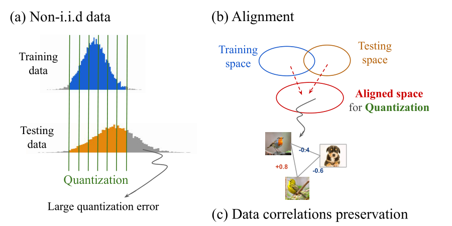

# AlignQ: Alignment Quantization with ADMM-based Correlation Preservation
Quantization, Efficient Inference


## Requirements

* python3
* pytorch==1.7.1
* cudatoolkit==11.0.221 
* numpy==1.19.2
* tensorboardx==1.4

## Implementation

### Single-domain tasks

* e.g. 8-bit ResNet-20 on CIFAR-10.

```shell
cd single_domain/resnet-20-cifar-10/cdf_alignment/
```

```shell
python3 main.py --job_dir "experiment/ours/resnet/t_8bit_pre32bit" --method "ours" --source_dir "pretrained" --source_file "res20_32bit/model_best.pt" --arch resnet --bitW 8 --abitW 8 --target_model "resnet20_quant" --source_model "resnet20" --num_epochs 300 --train_batch_size 128 --eval_batch_size 100 --lr 0.04 --lr_gamma 0.1 --lr_decay_steps [80, 120] --momentum 0.9 --weight_decay 0.0001 --lam 1 --lam2 4 --act_range 2 --print_freq 200
```
Pretrain weights saved to the path single_domain/resnet-20-cifar-10/cdf_alignment/pretrained/.

### Cross-domain tasks

* e.g. 8-bit DANN on Office-31 (D->W).

```shell
cd cross_domain/dann_office/cdf_admm/
```

```shell
python3 main.py --src_data "dslr" --tgt_data "webcam" --train_split "True" --job_dir "experiment/ours/resnet/t_8bit_pre32bit" --method "ours" --source_dir "pretrained" --source_file "dslr_webcam/dw_32bit/model_best.pt" --arch resnet --bitW 8 --abitW 8 --model "resnet50_dann" --num_epochs 100 --train_batch_size 28 --eval_batch_size 28 --lr 0.001 --lr_gamma 0.1 --lr_decay_steps [80, 120] --momentum 0.9 --weight_decay 0.0005 --lam 1 --lam2 4 --act_range 2 --print_freq 10
```
Pretrain weights saved to the path cross_domain/dann_office/daq_crp/pretrained/.


